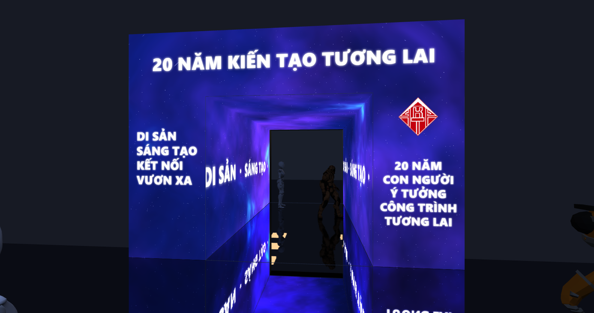
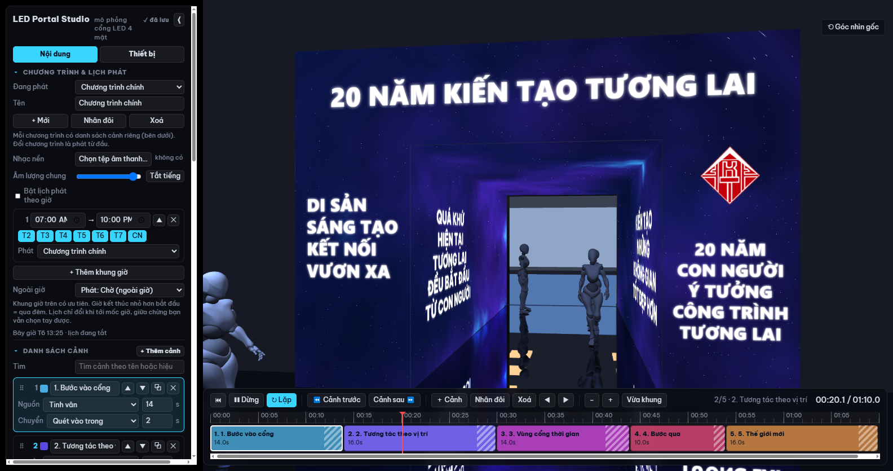
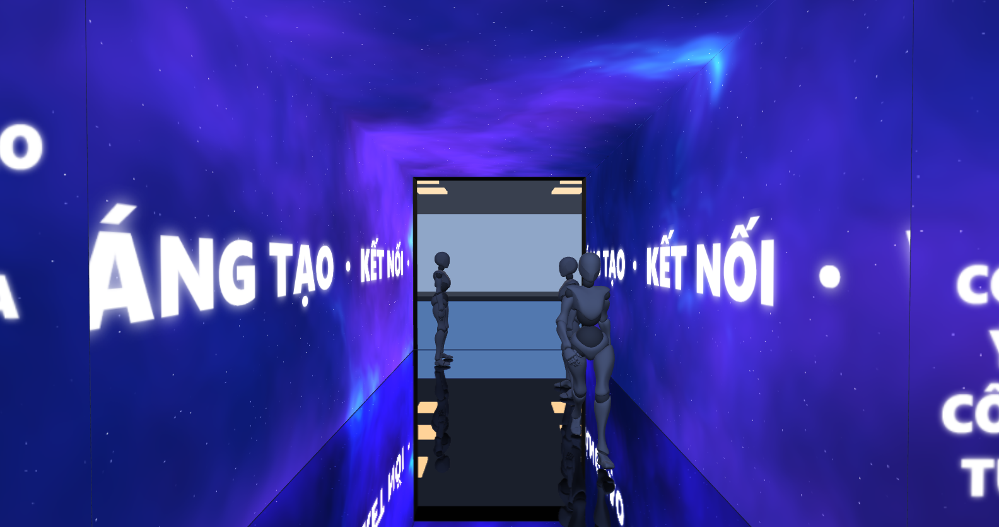
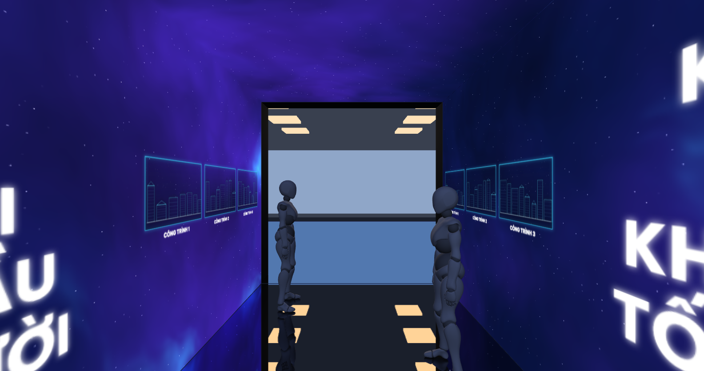
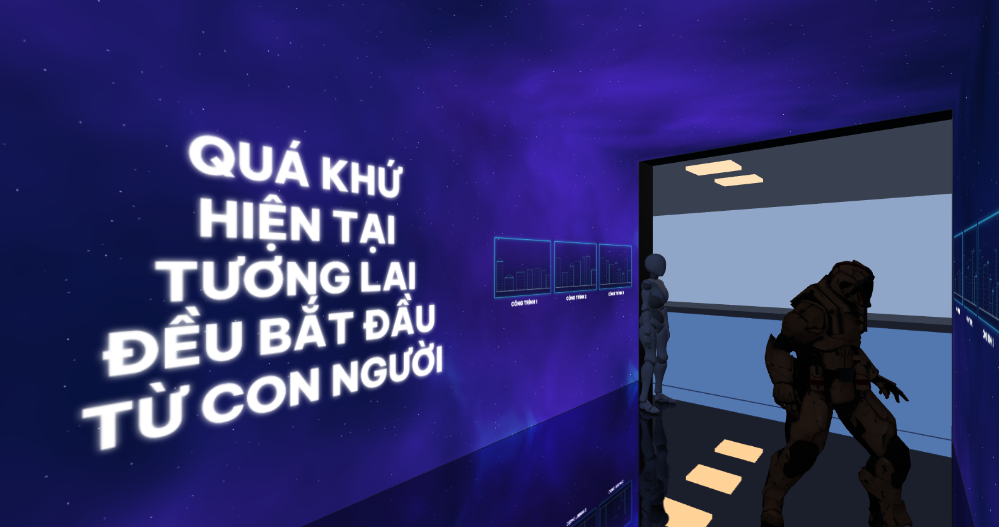
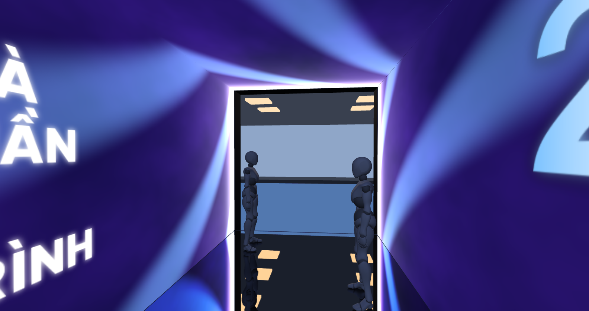
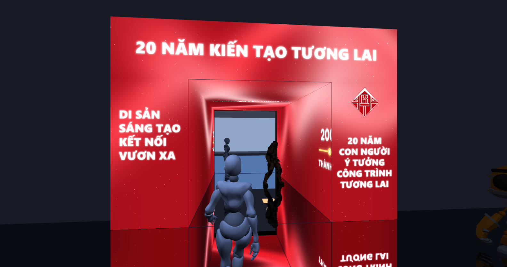
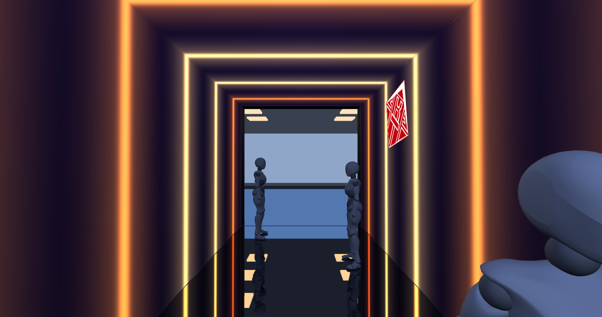
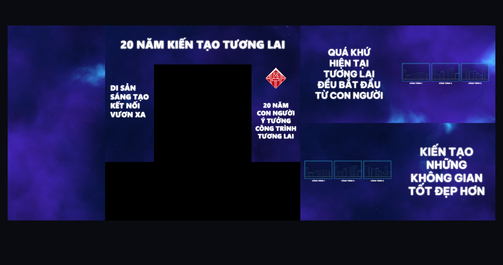

<div align="center">

# LED Portal Studio

**Phần mềm mô phỏng và điều khiển cổng LED dạng hộp — tường trái, tường phải, trần và mặt dựng**

Dựng nội dung chạy liền qua bốn mặt, xem trước trong mô phỏng 3D, rồi phát thẳng ra bộ xử lý LED hoặc xuất video MP4.




</div>

> *LED Portal Studio is an authoring tool and media server for walk-through LED portals. It models the portal as four screens (two walls, ceiling, front facade), renders content that flows seamlessly across all of them, previews it in a 3D walkthrough, then drives the real LED processor through borderless output windows — with schedules, audio, camera-based people tracking and MP4 export.*

---

## Mục lục

- [Giới thiệu](#giới-thiệu)
- [Tính năng](#tính-năng)
- [Hình ảnh](#hình-ảnh)
- [Cài đặt](#cài-đặt)
- [Bắt đầu nhanh](#bắt-đầu-nhanh)
- [Kích thước cổng và bản đồ pixel](#kích-thước-cổng-và-bản-đồ-pixel)
- [Xuất ra LED](#xuất-ra-led)
- [Tự chạy khi bật máy](#tự-chạy-khi-bật-máy)
- [Chương trình và lịch phát](#chương-trình-và-lịch-phát)
- [Tương tác theo vị trí người](#tương-tác-theo-vị-trí-người)
- [Xuất video MP4](#xuất-video-mp4)
- [Phím tắt](#phím-tắt)
- [Định dạng file dự án](#định-dạng-file-dự-án)
- [Kiến trúc](#kiến-trúc)
- [Phát triển](#phát-triển)
- [Giới hạn đã biết](#giới-hạn-đã-biết)
- [Lộ trình](#lộ-trình)
- [Ghi công và bản quyền](#ghi-công-và-bản-quyền)

## Giới thiệu

Cổng LED đi xuyên qua được là kiểu lắp đặt đang phổ biến ở lễ kỷ niệm, khai giảng, hội chợ: người đi qua một hành lang mà tường hai bên, trần và mặt dựng phía trước đều là màn LED. Cái khó không nằm ở chỗ phát video, mà ở chỗ **bốn mặt phải ăn khớp thành một không gian liền mạch** — hoạ tiết chạy từ mặt dựng vào tường, vòng lên trần rồi sang tường kia mà không thấy mối nối.

LED Portal Studio làm đúng việc đó. Bạn nhập kích thước cổng thật, dựng danh sách cảnh, phần mềm lo phần khó:

- mọi hiệu ứng viết theo **toạ độ mét trên bề mặt cổng** (độ sâu và chu vi), nên đổi kích thước cổng vẫn đúng và bốn mặt luôn liền nhau;
- gộp bốn màn thành **một bản đồ pixel** đúng độ phân giải LED, xếp gọn tự động, để bộ xử lý LED chỉ việc cắt vùng;
- **mô phỏng 3D** cho xem trước như đứng trong cổng thật, đi thử được bằng bàn phím;
- đóng vai **media server**: cửa sổ xuất không viền, phủ kín màn hình LED, đồng bộ thời gian với bảng điều khiển.

Dự án mẫu đi kèm là cổng kỷ niệm **20 năm thành lập Trường Đại học Kiến trúc Đà Nẵng (2006 – 2026)**, dựng đúng bản vẽ: lối đi thực tế 3,0 m, khung thép và tấm LED 0,5 m mỗi bên (tổng 4,0 m), cao 3,0 m, dài 6,0 m, mặt dựng 6,0 × 4,2 m, P2.5.

## Tính năng

### Nội dung chạy liền bốn mặt

| Loại | Mô tả |
|---|---|
| **12 hiệu ứng có sẵn** | Tinh vân, hầm sao, vòng sáng chạy, cổng thời gian, bản vẽ kiến trúc, cực quang, hạt sáng, dải màu, nhịp sáng, sóng màu, lụa đỏ kỷ niệm, màu đơn. Không cần nạp media vẫn có nội dung đẹp. |
| **Ảnh / video** | Ba cách dán: mỗi màn một bản, **trải phẳng chữ U** (một tệp phủ cả hai tường và trần), hoặc theo bản đồ pixel. Chọn phủ kín, vừa khung hay kéo giãn. |
| **Chữ nhiều dòng** | Đặt đúng vùng: dải trên lối vào, trụ trái, trụ phải của mặt dựng; nửa gần hay nửa xa của tường. Đậm hoặc thường, căn trái giữa phải, chạy ngang hoặc đứng yên. |
| **Logo / ảnh có khung sáng** | Logo trường đóng gói sẵn, hoặc ảnh PNG của bạn. Khung sáng và quầng bật tắt được. |
| **Dãy ảnh có chú thích** | Nhiều ảnh xếp ngang, mỗi ảnh một dòng chú thích, dùng cho dãy công trình dọc tường. |
| **Mốc thời gian** | Gõ mỗi dòng "năm nhãn", ra dải có đường, chấm sáng và mũi tên — kiểu 2006 Thành lập → 2026 Tương lai. |
| **Vật bay xuyên 4 màn** | Logo hoặc ảnh bay dọc cổng đồng thời xoáy quanh chu vi: trượt liền từ mặt dựng sang tường, lên trần, xuống tường kia. Chỉnh cỡ theo mét, tốc độ, số vòng, tự xoay, tới 5 bản cùng lúc. |

Mỗi cảnh có thời lượng riêng, tham số màu và tốc độ riêng, tiếng riêng, và **8 kiểu chuyển cảnh** diễn ra đồng thời trên cả bốn màn: cắt thẳng, mờ chồng, quét vào trong, quét ra ngoài, cổng mở tròn từ cuối hầm, tan hạt, chớp sáng, rèm sáng.

### Mô phỏng 3D

Dán bản đồ pixel lên đúng hình học cổng, có vỏ khung, sàn phản chiếu, sảnh trong nhà và nhân vật để cảm nhận tỉ lệ.

Bảy góc máy: ngoài sân nhìn vào, đứng ở cửa cổng, đứng trong cổng, ngước nhìn trần, cuối cổng nhìn ra, đi xuyên tự động, và **tự đi** — góc nhìn người thứ nhất điều khiển bằng bàn phím.

### Media server

Cửa sổ xuất không viền, phủ kín màn hình LED hoặc một vùng pixel tuỳ chỉnh, hiện **đúng 1:1** một vùng của bản đồ pixel. Mở được nhiều cửa sổ cho nhiều card gửi. Cửa sổ xuất tự dựng hình và tự ngoại suy thời gian nên LED vẫn mượt khi bạn đang thao tác.

### Vận hành tại sự kiện

Nhiều chương trình, lịch phát theo giờ và theo thứ trong tuần, tự chạy khi bật máy, tự mở lại cửa sổ xuất khi bị treo, nhạc nền và tiếng từng cảnh, tương tác theo vị trí người, xuất video MP4 để gửi khách duyệt.

## Hình ảnh

| Giao diện dựng | Đứng ở cửa cổng |
|---|---|
|  |  |
| **Trải nghiệm bên trong** | **Tường bên: chữ lớn và dãy công trình** |
|  |  |
| **Vùng cổng thời gian** | **Thế giới mới** |
|  |  |

Vật bay trượt liên tục qua các mặt, không thấy mối nối giữa các màn:



Bản đồ pixel là thứ thật sự gửi ra bộ xử lý LED — bốn màn xếp gọn trong một khung:



## Cài đặt

### Cách 1 — Bộ cài Windows

Tải `LEDPortalStudio-Setup-x.y.z.exe` ở trang [Releases](../../releases), chạy và làm theo hướng dẫn. Không cần quyền quản trị, không cần cài Node hay font.

> Bộ cài **chưa ký số**: lần đầu chạy, Windows SmartScreen sẽ cảnh báo — chọn **More info → Run anyway**.

### Cách 2 — Chạy từ mã nguồn

Yêu cầu: **Node.js 20+**, Windows 10/11 (bản web chạy được trên mọi máy có Chrome hoặc Edge, nhưng không mở được cửa sổ xuất phủ màn hình).

```bash
git clone https://github.com/niitbeo/20nam-led-hop.git
cd 20nam-led-hop
npm install
```

| Lệnh | Tác dụng |
|---|---|
| `npm run dev` | Bản web tại <http://localhost:5184> |
| `npm run app` | Build rồi mở bản Electron — có cửa sổ xuất ra LED |
| `npm run app:dev` | Electron nạp dev server (cần `npm run dev` đang chạy) |
| `npm run dist` | Đóng bộ cài Windows vào thư mục `release/` |
| `npm run typecheck` | Kiểm tra kiểu TypeScript |
| `npm run icon` | Vẽ lại icon ứng dụng (cần Python và Pillow) |
| `npm run shots` | Chụp lại bộ ảnh giới thiệu vào `docs/screenshots/` |

## Bắt đầu nhanh

1. Mở ứng dụng — dự án mẫu tự phát.
2. Tab **Thiết bị → Cổng LED**: nhập lối đi thực tế, chiều cao, chiều dài, khung mỗi bên và bước điểm LED. Bảng bên dưới hiện ngay số pixel từng màn và kích thước khung xuất.
3. Tab **Nội dung → Danh sách cảnh**: chọn cảnh, đổi nguồn hình nền, sửa thời lượng và kiểu chuyển cảnh.
4. **Thuộc tính cảnh**: chỉnh màu và tốc độ hiệu ứng, thêm lớp phủ (chữ, logo, dãy ảnh, mốc thời gian, vật bay), gắn tiếng cho cảnh.
5. Trên **thanh thời gian**: bấm khối để chọn cảnh, kéo thân để đổi thứ tự, kéo mép phải để đổi thời lượng, `Ctrl` và lăn chuột để phóng to. Trong danh sách cảnh cũng kéo được tay nắm `⠿` để đổi thứ tự, và có ô tìm cảnh (gõ không dấu vẫn ra).
6. Chọn góc máy **Tự đi** rồi dùng phím mũi tên để đi thử trong cổng.
7. **Lưu JSON** để mang sang máy khác. Ứng dụng cũng tự lưu sau mỗi thay đổi; nút **Dự án mẫu** đưa về bản gốc.

> **Lưu ý:** ảnh, video và nhạc nằm trong kho riêng của máy, **không nằm trong file JSON**. Chép dự án sang máy phát thì nạp lại media ở máy đó.

## Kích thước cổng và bản đồ pixel

Bản vẽ thường ghi **bề rộng tổng**, còn phần mềm cần **lối đi thực tế** — phần chênh là khung thép và tấm LED hai bên:

```
bề rộng tổng = lối đi thực tế + 2 × khung mỗi bên
   4,0 m      =      3,0 m      + 2 ×    0,5 m
```

Từ kích thước mét và bước điểm, phần mềm tính ra số pixel từng màn rồi **xếp gọn tự động** vào khung xuất nhỏ nhất có thể. Với cổng mẫu ở P2.5:

| Màn | Kích thước | Điểm ảnh |
|---|---|---|
| Tường trái | 6,0 × 3,0 m | 2400 × 1200 |
| Tường phải | 6,0 × 3,0 m | 2400 × 1200 |
| Trần | 3,0 × 6,0 m | 1200 × 2400 |
| Mặt dựng | 6,0 × 4,2 m | 2400 × 1680 |
| **Khung xuất** | | **6000 × 2400** — nội dung 12,67 Mpx, lấp đầy 88% |

Muốn khớp cách cắt vùng của bên kỹ thuật thì mở **Bố cục khung xuất** và nhập tay toạ độ x, y từng màn.

## Xuất ra LED

Cắm tường LED hoặc bộ xử lý LED vào máy qua HDMI như một màn hình thứ hai, rồi vào **Thiết bị → Xuất ra LED**:

1. **Màn hình** — chọn màn hình LED (danh sách tự cập nhật khi cắm rút).
2. **Cửa sổ** — *Phủ kín màn hình*, hoặc *Vùng tuỳ chỉnh* rồi nhập x, y, rộng, cao theo pixel.
3. **Vùng nguồn** — toàn bộ khung, hoặc riêng một màn (tường trái, tường phải, trần, mặt dựng), hoặc một vùng pixel tuỳ chỉnh.
4. **▶ Mở cửa sổ xuất**. Bấm `Esc` trên cửa sổ xuất để đóng.

Mở được nhiều cửa sổ cùng lúc, mỗi cửa sổ một vùng nguồn — dùng khi có nhiều card gửi. Mặc định hiện **1:1 ở góc trên bên trái**, tích "Co vừa cửa sổ" nếu muốn xem thu nhỏ.

Bản web cũng thử được bằng nút **Mở tab xuất thử**, nhưng chỉ bản Electron mới mở được cửa sổ không viền phủ kín màn hình.

## Tự chạy khi bật máy

Trong **Xuất ra LED → Tự chạy khi bật máy**:

1. Mở đúng các cửa sổ xuất cần dùng.
2. Bấm **Lưu bộ cửa sổ hiện tại** — app nhớ màn hình, vùng cửa sổ và vùng nguồn của từng cái.
3. Tích **Tự mở bộ đã lưu khi khởi động app**.
4. Tích **Chạy app khi đăng nhập Windows**.

Bật máy là LED tự chạy, không phải bấm gì. Cửa sổ xuất bị treo hay crash sẽ **tự mở lại sau 1,5 giây**. Nếu Windows đổi thứ tự màn hình sau khi khởi động lại, app tìm lại theo thứ tự đã lưu rồi mới rơi về màn chính.

## Chương trình và lịch phát

Một dự án chứa nhiều **chương trình**, mỗi chương trình có danh sách cảnh và nhạc nền riêng.

**Lịch phát theo giờ**: thêm các khung giờ, mỗi khung chọn thứ trong tuần (T2 đến CN), giờ bắt đầu, giờ kết thúc và chương trình phát. Giờ kết thúc nhỏ hơn giờ bắt đầu nghĩa là qua đêm. Khung giờ đứng trên có ưu tiên. Ngoài mọi khung giờ thì **tắt màn** hoặc phát một **chương trình chờ**.

Lịch chỉ chuyển khi tới mốc giờ, nên giữa chừng bạn vẫn chọn tay chương trình khác được; tới mốc kế tiếp lịch mới lấy lại quyền. Lịch dựa vào đồng hồ máy phát nên máy đó cần đúng giờ.

## Tương tác theo vị trí người

Bật trong **Thiết bị → Tương tác theo vị trí người**, chọn một trong ba nguồn:

| Nguồn | Dùng khi |
|---|---|
| **Mô phỏng** | Dựng và thử ở nhà. Người ảo tự đi, cộng `Shift` và kéo chuột trên sàn 3D để đặt thêm người. |
| **WebSocket** | Đã có hệ tracking riêng. Gửi JSON mỗi khung: `{"persons":[{"id":1,"x":0.4,"d":2.5}]}` — `x` ngang (0 là tim cổng), `d` độ sâu (0 là lối vào). Tự kết nối lại khi rớt. |
| **Camera + AI** | Webcam cắm thẳng vào máy phát. MediaPipe nhận diện người **chạy hoàn toàn offline**, không cần mạng. |

Với nguồn camera, bấm **Hiệu chỉnh sàn** rồi bấm 4 góc sàn cổng trên ảnh theo thứ tự lối vào trái → lối vào phải → cuối phải → cuối trái. Màn hiệu chỉnh vẽ lưới sàn và toạ độ người suy ra để kiểm tra ngay tại chỗ.

Mỗi cảnh chọn cách phản ứng: **quầng sáng theo người**, **sóng lan từ chân người**, **chỉ hé mở quanh người**, và **lái tham số** — một thanh trượt của hiệu ứng đi từ mức lối vào tới mức cuối cổng theo người đi xa nhất.

Ở góc máy **Tự đi**, chính bạn cũng được tính là một người: đi tới đâu màn phản ứng tới đó, và vị trí đó gửi luôn sang cửa sổ xuất.

## Xuất video MP4

Nút **Xuất video MP4 mô phỏng** ở tab Thiết bị. Chọn độ phân giải (720p, 1080p, 1440p), 25 / 30 / 60 hình mỗi giây, góc máy, đoạn thời gian, có kèm tiếng và người ảo hay không.

- Video **dựng từng khung hình** chứ không quay màn hình: không rớt khung, không dính giao diện, xuất lần nào cũng ra kết quả giống hệt.
- Tiếng được trộn riêng gồm nhạc nền và tiếng từng cảnh, chồng mờ đúng như lúc phát.
- Ghi thẳng ra đĩa trong lúc mã hoá nên đoạn dài không làm tràn bộ nhớ.
- Tốc độ do bộ mã hoá H.264 của máy quyết định. Đo trên máy dùng đồ hoạ tích hợp: 720p khoảng 10 khung mỗi giây, 1080p cả chương trình 70 giây mất chừng 5 đến 7 phút. Máy có card rời nhanh hơn nhiều.

## Phím tắt

| Phím | Tác dụng |
|---|---|
| `Space` | Phát / tạm dừng |
| `←` `→` | Tua 1 giây (`Shift`: 5 giây) |
| `[` `]` hoặc `PageUp` `PageDown` | Nhảy tới cảnh trước / cảnh sau |
| `Home` `End` | Về đầu / cuối chương trình |
| `Delete` | Xoá cảnh đang chọn |
| `Ctrl` + `D` | Nhân đôi cảnh đang chọn |
| `Ctrl` + `Z` / `Ctrl` + `Y` | Hoàn tác / làm lại (giữ 60 bước) |
| `Ctrl` + lăn chuột | Phóng to / thu nhỏ thanh thời gian |
| `Shift` khi kéo mép khối | Chỉnh mịn 0,1 giây |
| `0` | Đưa góc nhìn về mặc định |
| `H` | Ẩn / hiện bảng điều khiển |
| `Esc` (cửa sổ xuất) | Đóng cửa sổ xuất LED |

Ở góc máy **Tự đi**:

| Phím | Tác dụng |
|---|---|
| `↑` `↓` | Đi tới / lui |
| `←` `→` | Quay người |
| `A` `D` hoặc `Q` `E` | Bước ngang |
| `R` `F` hoặc `PageUp` `PageDown` | Ngẩng / cúi |
| `Shift` | Chạy |
| Kéo chuột trái | Nhìn quanh (bấm đúp để khoá chuột, `Esc` thả) |

## Định dạng file dự án

Một dự án là **một file JSON** — dễ chép, dễ sửa tay, và là giao diện để script hay AI sinh nội dung tự động.

```jsonc
{
  "version": 1,
  "name": "Cổng Kiến Tạo DAU",

  // kích thước thật, đơn vị mét; bề rộng tổng = width + 2 × frameThickness
  "portal": { "width": 3, "height": 3, "length": 6, "frameThickness": 0.5,
              "facadeWidth": 6, "facadeHeight": 4.2, "pitchMm": 2.5 },

  // vị trí góc trên-trái từng màn trong khung xuất (pixel)
  "layout": { "ceiling": { "x": 0, "y": 0 }, "facade": { "x": 1200, "y": 0 },
              "left": { "x": 3600, "y": 0 }, "right": { "x": 3600, "y": 1200 } },

  "loop": true,
  "music": null,                        // hoặc { "id", "name", "volume", "loop" }
  "activeProgram": "prog-main",
  "programs": [
    { "id": "prog-main", "name": "Chương trình chính", "loop": true, "music": null, "scenes": [] }
  ],

  "schedule": {
    "enabled": true,
    "rules": [ { "id": "r1", "days": [true, true, true, true, true, true, true],
                 "start": "07:00", "end": "22:00", "programId": "prog-main" } ],
    "offMode": "program",               // "black" = tắt màn ngoài giờ
    "offProgram": "prog-idle"
  },

  "interaction": {
    "enabled": false,
    "source": "sim",                    // "sim" | "ws" | "camera"
    "wsUrl": "ws://127.0.0.1:8765",
    "camera": { "deviceId": "", "flipX": false, "minScore": 0.45, "calib": null },
    "sim": { "walkers": 2 }
  },

  "scenes": [
    {
      "id": "s1",
      "name": "1. Bước vào cổng",
      "duration": 14,
      "effect": "nebula",               // id hiệu ứng, hoặc "media"
      "params": { "c1": "#0a1560", "speed": 1, "intensity": 1 },
      "media": null,                    // { "id", "name", "kind", "mapping", "fit" }
      "audio": null,                    // { "id", "name", "volume", "loop" }
      "text": { "enabled": false, "text": "", "color": "#ffffff", "size": 0.3, "speed": 0.25,
                "screens": { "left": true, "right": true, "ceiling": false, "facade": false } },
      "overlays": [
        { "kind": "text", "zone": "header", "text": "20 NĂM KIẾN TẠO TƯƠNG LAI",
          "size": 0.55, "x": 0.5, "y": 0.5, "color": "#ffffff",
          "screens": { "left": false, "right": false, "ceiling": false, "facade": true } },

        { "kind": "fly", "mediaId": "builtin:dau-logo", "size": 1.2,
          "speed": 2.6, "spin": 0.16, "selfSpin": 0.3, "count": 3,
          "screens": { "left": true, "right": true, "ceiling": true, "facade": true } }
      ],
      "interact": { "mode": "reveal", "color": "#ffffff", "radius": 2.2, "intensity": 1,
                    "speed": 1.5, "driveParam": "", "driveFrom": 0, "driveTo": 1 },
      "transition": "wipeIn",
      "transitionDuration": 2
    }
  ]
}
```

`scenes` và `music` ở gốc luôn là nội dung của chương trình đang phát; các chương trình khác nằm trong `programs`.

## Kiến trúc

**Một nguồn sự thật duy nhất: bản đồ pixel.** Mô phỏng 3D và cửa sổ xuất đều chỉ đọc lại texture này, nên cái bạn thấy khi dựng đúng bằng cái lên LED.

```
Project (JSON)
   │
   ├─ geometry.ts ── toạ độ mét của 4 màn + vị trí pixel trong khung xuất
   │
   ├─ Compositor ─── lớp cảnh A ┐
   │                 lớp cảnh B ┼─ pass chuyển cảnh ─► texture "bản đồ pixel"
   │                 lớp phủ    │                          │
   │                 lớp tương tác ┘                       ├─► Preview 3D (bảng điều khiển)
   │                                                       └─► cửa sổ xuất ra LED (1:1)
   │
   └─ tracking ─── mô phỏng / WebSocket / camera AI ─► danh sách người ─► lớp tương tác
```

- Hiệu ứng viết bằng GLSL theo **toạ độ hầm**: `u` là độ sâu tính từ lối vào, `v` là vị trí trên chu vi (hai tường cộng trần). Mặt dựng có `u` âm. Nhờ vậy hoạ tiết tràn liền qua bốn mặt.
- Bảng điều khiển và cửa sổ xuất **tự dựng hình riêng**, chỉ trao đổi dự án và mốc thời gian qua `BroadcastChannel`. Cửa sổ xuất ngoại suy thời gian từ mốc gần nhất nên LED mượt kể cả khi bảng điều khiển bị che.
- Vì hai bên tự dựng riêng nên **khung hình phải tất định** theo dự án và thời gian: hiệu ứng chỉ dùng thời gian cục bộ của cảnh, không dùng số ngẫu nhiên, không phụ thuộc tốc độ khung hình.
- Không có bước đổi màu nào trong toàn bộ đường dựng hình: màu hex bạn nhập lên LED đúng như vậy.

Chi tiết từng tệp và các bẫy đã gặp nằm trong [CLAUDE.md](CLAUDE.md).

## Phát triển

```
src/
  model.ts         Project, Scene, Overlay, Program, Schedule; xếp gọn khung xuất
  geometry.ts      hình học 4 màn, hệ trục, buffer đỉnh
  control.ts       cửa sổ điều khiển: vòng lặp, lịch phát, hoàn tác
  output.ts        cửa sổ xuất ra LED
  timeline.ts      thanh thời gian
  ui.ts            bảng trái
  audio.ts         nhạc nền và tiếng cảnh
  export.ts        xuất MP4
  render/
    shaders.ts     GLSL dùng chung, toạ độ hầm
    effects.ts     thư viện hiệu ứng
    compositor.ts  dựng bản đồ pixel, chuyển cảnh, lớp phủ, tương tác
    preview.ts     mô phỏng 3D, camera, nhân vật
    text.ts        chữ, mốc thời gian, dãy ảnh
    characters.ts  nhân vật glTF
  tracking/        nguồn vị trí người, hiệu chỉnh camera, ghép id
electron/          tiến trình chính, cửa sổ xuất, tự kiểm tra
build/             icon, tài nguyên tự vẽ, script chụp ảnh
```

**Thêm một hiệu ứng** = thêm một mục vào `EFFECTS` trong `render/effects.ts`: khai báo tham số và viết hàm GLSL `effect(u, v, un, vn)`. Giao diện tự sinh thanh trượt và ô màu.

**Tự kiểm tra bản Electron**: đặt biến môi trường `LEDPORTAL_SELFTEST=<thư mục>` rồi `npx electron .` — app mở một cửa sổ xuất, chụp ảnh hai cửa sổ, kiểm tra lệch thời gian và khả năng tự mở lại, ghi `report.json` rồi tự thoát.

## Giới hạn đã biết

- **Chưa thử với camera thật và bộ xử lý LED thật.** Phần mềm chạy đủ nhưng chưa nghiệm thu tại hiện trường.
- Bộ cài **chưa ký số**, SmartScreen sẽ cảnh báo lần đầu.
- Ba ảnh công trình và số "20" trong dự án mẫu là hình **tự vẽ tạm**; nên thay bằng ảnh thật của trường.
- Khung xuất tối đa 8192 pixel mỗi chiều mới giữ được tỉ lệ 1:1.
- Ảnh, video và nhạc lưu trong kho của máy, không nằm trong file JSON.
- Chỉ chạy trên **một máy phát**; chưa đồng bộ nhiều máy.

## Lộ trình

- [ ] Nghiệm thu với camera và bộ xử lý LED tại hiện trường
- [ ] Điều khiển từ điện thoại trong cùng mạng
- [ ] Ký số bộ cài
- [ ] Hướng dẫn vận hành một trang cho người trực sự kiện
- [ ] Đếm ngược giờ khai mạc, lời chúc chạy trực tiếp

## Ghi công và bản quyền

- Mã nguồn: NLTruong.
- Mô hình nhân vật `Xbot.glb` và robot `RobotExpressive.glb` lấy từ kho ví dụ của [three.js](https://github.com/mrdoob/three.js) (Mixamo và Tomás Laulhé, CC0).
- Nhận diện người bằng [MediaPipe Tasks Vision](https://developers.google.com/mediapipe) và model EfficientDet-Lite0 của Google (Apache 2.0), đóng gói sẵn để chạy offline.
- Font **Be Vietnam Pro** (SIL Open Font License).
- Logo Trường Đại học Kiến trúc Đà Nẵng thuộc về nhà trường, dùng trong dự án mẫu cho mục đích trình bày.

Phần mềm này là công cụ **mô phỏng và trình chiếu**. Nó không thay thế khảo sát kỹ thuật khi thi công LED thật.
